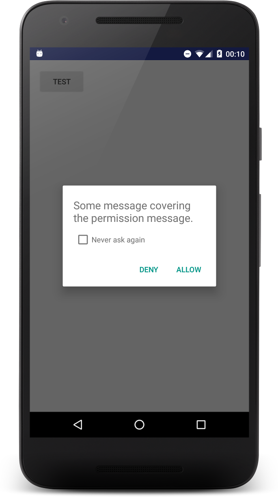

# Marshmallow Permissions Hijacking

This project demonstrates how Android Marshmallow permission dialog can be hijacked.

I reported very similar vulnerability to Google in May 2015 (ANDROID-21485727) but they failed to fix it.
I also submitted couple patches to AOSP ([gerrit](https://android-review.googlesource.com/#/c/157670/))
but they got ignored so I decided to share my findings here.

If you're maintaining some open-source ROM and you need more info on how to fix this vulnerability
feel free to create Issues with questions.

### Contacts access dialog

### Hijacked dialog

## How it works

The app displays an overlay window (type `TYPE_SYSTEM_OVERLAY`) on top of the permission dialog so that permission message is obstructed but ALLOW/DENY buttons are visible. The user may grant permission thinking that he is answering a different question.

Android developers attempted to mitigate this issue by making displaying system overlays by apps much harder in Marshmallow (user have to explicitly grant access from system Settings screen). Unfortunately their solution is broken on many levels.

1. The permission screen isn’t that scary so user may not realize that by granting this permission to the app they’re agreeing that the app may mess up with the system. Especially that the user can see that lots of mainstream app have this permission (Clock, Facebook, Google Play Music, Photos, Skype, Twitter, etc.)

1. The new permission mechanism is enforced only for apps targeting Marshmallow. Apps targeting Lollipop or below can still draw over other apps even without any warning being displayed by Google Play during installation.

## Project details

This project contains two apps:

 - `app` is the main app targeting Marshmallow and displaying a permission dialog
 - `service` a helper app targeting Lollipop which contains a service displaying an overlay.

In real exploit user would have to be tricked into installing the helper app but it shouldn’t be difficult. It could be disguised as “Marshmallow Theme” or something similar. There are many apps which require installation of additional helper packages so it’d be nothing special to the user.

## Fix

The proper fix should not aim to make displaying overlays more difficult or shift responsibility onto end users. Instead it should allow detecting if given dialog/window is partially obscured and block user actions in such case. In case of overlaying windows the dialog could be brought forward or some error message toast could be displayed.

Such solution could be based on an additional `MotionEvent` flag which I proposed in AOSP patches.
